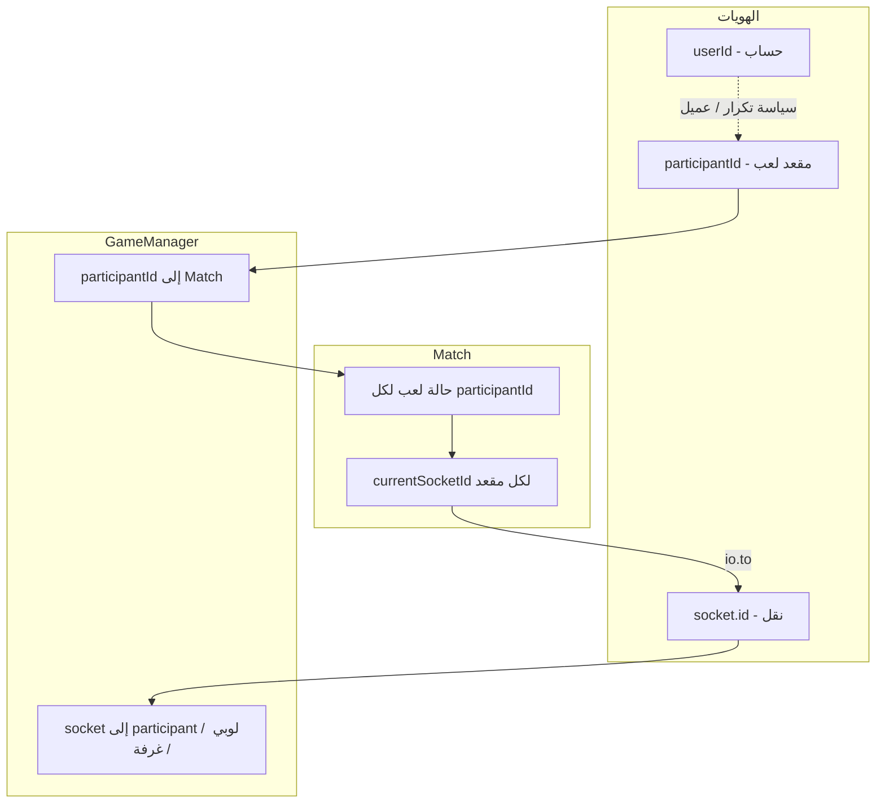

# الهوية في اللعب، المشاركون، واستعداد إعادة الاتصال

**وثائق Phase E (حدود زمن حقيقي):** [عقد أحادية العقدة](RUNTIME_SINGLE_NODE_CONTRACT.md) · [الإيقاف والتصريف](RUNTIME_LIFECYCLE_SHUTDOWN.md) · [ملكية المؤقتات](RUNTIME_TIMER_OWNERSHIP.md) · [idempotency إعادة الربط](RECONNECT_IDEMPOTENCY_CONTRACT.md) · [جاهزية persistence/توزيع](PERSISTENCE_AND_DISTRIBUTION_READINESS.md)

هذا المستند يلخّص الوضع الحالي بعد هجرة **`participantId`** كهوية لعب سلطة، و**`userId`** كهوية حساب/سياسة، مع بقاء **`socket.id`** لطبقة النقل فقط.

---

## 1) نموذج الهوية (النهائي المستهدف)

| المفهوم | الدور |
|--------|--------|
| **`participantId`** | مقعد جلسة اللعب: اللوبي، الجاهزية، الإجابات المعلّقة، المباراة، الإقصاء، الغرف الخاصة، المضيف. |
| **`userId`** | حساب مستقر (Firebase): سياسة التكرار، مطابقة «أنا» على العميل، ربط فريق/سياسات لاحقًا. |
| **`socket.id`** | اتصال Socket.IO حيّ: `emit`، `join`/`leave`، خرائط مقبس↔مشارك في `GameManager`. |

---

## 2) أين تعيش الحالة ومن يملك الخرائط؟

- **`Match` (`server/game/Match.ts`)**  
  - يملك **`Map<participantId, MatchPlayerState>`** بما فيها `currentSocketId` (عنوان نقل حالي فقط).  
  - منطق الجولة، النقاط، المفاتيح، القدرات، الجاهزية للمذاكرة، الإجابات المعلّقة — كلها بمفتاح **`participantId`**.

- **`GameManager` (`server/game/GameManager.ts`)**  
  - لوبي عام: **`lobbies[mode]`** بمفتاح **`participantId`** + **`socketToPublicLobbyRef`** (مقبس → مرجع اللوبي).  
  - غرف خاصة: **`members`** بمفتاح **`participantId`** + **`hostParticipantId`** + **`socketToPrivateParticipantId`**.  
  - أثناء المباراة: **`socketToParticipantId`**, **`participantIdToSocket`**, **`participantIdToMatch`**, **`runningMatches`**, ووسم **`fahemMatchId`** على `socket.data` للمشاهد بعد انقطاع الربط المباشر للمقعد.

- **`LobbyEntry`** ما زال يحفظ **`socketId`** لأغراض النقل (إرسال ACK، طرد duplicate، `io.to`) وليس كهوية لعب في الحمولات المرسلة للعميل.

---

## 3) دورة حياة المشارك (مختصرة)

1. **دخول لوبي/غرفة**: يُنشأ `participantId` جديد، يُربط المقبس بخرائط النقل أعلاه، يُخزَّن `userId` عند توفره.  
2. **بدء مباراة**: تُمرَّر مقاعد **`MatchSeatInput`** (`participantId`, `connectionSocketId`, `userId`, …) إلى `Match`؛ يُسجَّل التوجيه عبر `registerMatchRouting`.  
3. **أثناء المباراة**: كل أحداث اللعب والحمولات للعميل تستخدم **`participantId`** / **`userId`** حيث ينطبق.  
4. **انقطاع المقبس أثناء مباراة نشطة**: `disconnect` يزيل اللوبي/الغرفة الخاصة، ثم يدخل مسار **نافذة سماح** (`MATCH_RECONNECT_GRACE_MS` في `server/game/reconnectConfig.ts`): يُحذف ربط **`socketToParticipantId`** و**`participantIdToSocket`** فقط، ويُؤجَّل **`Match.handleDisconnect(participantId)`** حتى انتهاء المهلة أو نجاح **`resume_match`**. تبقى **`participantIdToMatch`** و`runningMatches` كما هي. تُسجَّل أحداث **`grace_started`** / **`grace_expired_eliminate`** / **`grace_cleared`** (عند الاستئناف) في **`[fahem_reconnect]`** للتشخيص.  
5. **استئناف النقل**: العميل يرسل **`resume_match`** مع `matchId` و`participantId` و`resumeSecret`؛ الخادم يتحقق ثم يستدعي **`syncParticipantSocket`** ويُعيد تعبئة خرائط النقل و`join` غرفة المباراة، ويعيد **`snapshot`** في ACK الاستئناف (لقطة حالة للمزامنة).  
6. **انتهاء المباراة**: `unregisterMatchRoutingForMatch` يُلغي مؤقتات الاستئناف المعلّقة ويزيل جميع الروابط.

---

## 4) دورة حياة الانقطاع (مفصولة عن «ملكية» اللعب)

- **تنظيف النقل واللوبي**: `removeFromLobby` / `removeFromPrivateRoom` — لا تغيّر قواعد اللعب داخل `Match` إلا عبر المسار الصريح.  
- **تأثير اللعب بعد انتهاء السماح أو خروج صريح**: `Match.handleDisconnect(participantId)` — إقصاء اللاعب وفق القواعد الحالية (`handleDisconnect` لا يعمل إذا **`finished`**).  
- **فصل المسؤوليات**: ملكية المقعد منطقيًا في `Match`؛ حلّ المقبس النشط في `GameManager` لغرض الإرسال فقط.  
- **غرفة خاصة أثناء مباراة**: عند بدء المباراة من الغرفة الخاصة يُزال المقبس من **`socketToPrivateRoomCode`**؛ لذلك `removeFromPrivateRoom` على `disconnect` أثناء اللعب عادةً لا يزيل عضوًا من الغرفة.

---

## 5) إعادة الربط (مفعّلة)

| النقطة | الغرض |
|--------|--------|
| **`match_resume_token`** (بعد `game_started`) | إرسال **`resumeSecret`** (Base64URL من 32 بايت عشوائي) و`reconnectGraceMs` لكل مقعد؛ العميل يخزّنها في **`sessionStorage`** (`fahem_match_resume_v1`). |
| **`resume_match`** | التحقق من الرمز والمقعد؛ **آخر مقبس يفوز** (فصل المقبس السابق لنفس `participantId`)؛ `syncParticipantSocket`؛ إعادة الخرائط و`tagSocketMatchBinding`؛ **`join(match.room)`**؛ إلغاء مؤقت السماح؛ **حد معدل** (~25 طلباً / 60 ثانية لكل مقبس) يردّ `rate_limited`؛ بعد النجاح: إعادة بث تصويت الكابتن عند الحاجة، ثم **`match_resume_token`** برمز جديد (`rotateResumeSecret`)، وسجل **`[fahem_reconnect]`** منظّم (بدون الرمز). |
| **`continue_as_spectator`** | يتطلّب مباراة حية عبر `fahemMatchId`؛ يُفضَّل إرسال **`participantId`** في الجسم؛ **`join(match.room)`** + `keys_room_state` للمقعد + لقطة `snapshot` في ACK عند النجاح. |
| **`Match.buildMatchStateSnapshot(participantId)`** | لقطة في ACK: `gameStarted`، `keysRoomState`، `question` (إن وُجد سؤال حي)، `study` (آخر حزمة مذاكرة تبقى حتى بداية السؤال الحي)، **`matchPhaseHint`** (`study` \| `between` \| `question` \| `idle`)، `teamVoteResync` (وضع كابتن). |
| **`Match.verifyResumeSecret` / `canResumeTransport`** | رفض الرموز الخاطئة؛ السماح للمشاهد بعد قلوب (`eliminated` + `isSpectator`) باستئناف المشاهدة. |
| **`getMatchForConnectedSocket` + `fahemMatchId`** | ما زال يدعم مسار المشاهد بعد فقدان تعيين المقعد المباشر. |

---

## 6) سياسة الجلسات المكررة (tabs / مقابس قديمة)

- **`evictDuplicateLobbySocket`**: يقطع اتصال أي مقعد آخر في **نفس سلة اللوبي** إذا تطابقت **`userId`** **أو** **`playerSessionId`** مع الوارد (مع فلاتر الوضع/الصعوبة/الدرس).  
- **`evictDuplicatePrivateMember`**: نفس المنطق داخل غرفة خاصة واحدة.  
- **`resume_match`**: إن وُجد مقبس سابق مسجّل لنفس `participantId` في المباراة نفسها يُفصل قسرًا لصالح المقبس الجديد.  
- **السلوك**: حتمي — المقبس الأحدث يبقى في سياق الاستئناف؛ الأقدم يُفصل بقوة.

---

## 7) ما زال يعتمد على المقبس (نطاق النقل فقط)

- **`LobbyEntry.socketId`**: إرسال وإدارة الغرف و`disconnect` على المقبس الحالي.  
- **`MatchPlayerState.currentSocketId`**: وجهة `io.to(...)` لرسائل خاصة (مثل `question_result` لكل لاعب، `spectator_offer`).  
- **غرف Socket.IO** (`lobby:…`): عنوان جماعي للبث.  
لا تُعرَض هذه القيم كهوية لعب في واجهة العميل بعد التحديث الأخير لـ `client/src/main.ts`.

---

## 8) ديون تقنية ومخاطر قبل Team Mode

| البند | الملاحظة |
|--------|-----------|
| **`myParticipantId` على العميل** | يُستنتج من `userId` في الحمولة؛ إن فشلت المزامنة قبل `game_started` قد تحتاج لاحقًا رسالة صريحة من الخادم (`youParticipantId`). |
| **`player_eliminated` — fallback بالاسم** | احتياطي ضعيف إن فقد `participantId`؛ الخادم يرسل `participantId` حاليًا. |
| **Reconnect** | مفعّل لمسار المباراة: نافذة سماح ثم **`resume_match`** + لقطة حالة؛ انظر **`docs/MANUAL_QA_RECONNECT_MATRIX.md`**. |
| **Team Mode** | وضع الفرق يعمل على **`participantId`**؛ إعادة الربط تعيد لقطة التصويت/السؤال عند الحاجة. |

---

## 9) التحقق من البناء

- تشغيل **`npm run build`** (عميل + خادم) بعد تغييرات إعادة الربط.  
- **الاختبار اليدوي**: راجع **`docs/MANUAL_QA_RECONNECT_MATRIX.md`** (لوبي، غرفة خاصة، فردي، فرق، انقطاع قصير/طويل، تبويبان، مذاكرة/سؤال).

---

## 10) مخطط معماري مبسّط

**جاهزية Team Mode (تقدير):** جيدة على مستوى **فصل الهوية** و**ملكية الغرفة بالمشارك**؛ يتبقى تصميم نموذج «فريق» (عدة `participantId` لكل فريق) وقواعد الجاهزية/البدء — خارج نطاق هذا المستند.
