# دورة حياة التشغيل — التصريف والإيقاف (Phase E)

يصف تسلسل **تشغيل عادي** → **تصريف (draining)** → **إيقاف منضبط** كما تُنفَّذ في الكود، مع نقطة الحارس في `index.ts`.

المرجع في الكود: [`server/shutdownSequence.ts`](../server/shutdownSequence.ts)، [`server/index.ts`](../server/index.ts)، [`server/game/GameManager.ts`](../server/game/GameManager.ts) (`beginDrain`, `abortAllMatchesForShutdown`, `stopPeriodicTasks`).

مرتبط: [عقد أحادية العقدة](RUNTIME_SINGLE_NODE_CONTRACT.md).

---

## 1) مخطط حالات (مفاهيمي)

```mermaid
stateDiagram-v2
  direction LR
  [*] --> Running: process_start
  Running --> Draining: SIGINT_or_SIGTERM
  Draining --> ShutdownSockets: gracefulShutdown_phases
  ShutdownSockets --> EngineClosed: engine_close_timeout
  EngineClosed --> HttpClosed: http_close_timeout
  HttpClosed --> DbClosed: closePool
  DbClosed --> [*]: process_exit_optional
```

- **Running**: مقابس نشطة، مباريات في `runningMatches`، لوبي/غرف خاصة.
- **Draining**: `game.beginDrain()` — `draining === true`، بث `server_draining`، رفض مسارات الانضمام الجديدة في المعالجات التي تتحقق من `isDraining()`.
- **ما بعد Draining**: إنهاء المباريات، إيقاف مهام دورية، قطع المقابس، إغلاق المحرك/HTTP/DB.

---

## 2) تسلسل `gracefulShutdown` (ترتيب التنفيذ)

1. **`beginDrain`**: إعلان للعملاء + تفعيل الرفض على مسارات حرجة (انضمام/غرفة/استئناف حسب الكود).
2. **`abortAllMatchesForShutdown`**: لكل `Match` نشط — `abortDueToServerShutdown()` ثم `unregisterMatchRoutingForMatch`؛ مسح `runningMatches`؛ إلغاء `pendingReconnectByParticipantId`؛ إلغاء `matchStartTimers` العامة وإعادة تعيين عدّ اللوبي المرتبط بالانطلاق؛ ثم مسح عدّ/أقفال الغرف الخاصة (`privateRooms`) وإشعار حالة اللوبي الخاص عند التغيير.
3. **إيقاف جدولة محتوى بسيط** و**cron تنظيف** (إن وُجد).
4. **`stopPeriodicTasks`**: حالياً يوقف `privateRoomGcInterval` فقط.
5. **`io.disconnectSockets(true)`**: قطع جميع المقابس.
6. **`engine.close`** ثم **`httpServer.close`** بمهلات من [`shutdownUtils`](../server/shutdownUtils.ts).
7. **`closePool`**: إغلاق مجمع اتصالات PostgreSQL.

كل مرحلة تُسجَّل تحت `cat: "shutdown"` (`shutdown_phase` / `shutdown_phase_failed`).

---

## 3) حارس عدم التكرار (`server/index.ts`)

- المتغير **`shuttingDown`**: يضمن أن معالج `SIGINT`/`SIGTERM` لا يستدعي `gracefulShutdown` أكثر من مرة متزامنة (الاستدعاء الثاني يُهمل).
- **عقد**: لا يُفترض أن `gracefulShutdown` آمن لإعادة الدخول من عدة مكدسات استدعاء متزامنة بدون هذا الحارس.

---

## 4) ماذا يحدث للاعب أثناء النشر؟

- قد يتلقى `server_draining` ثم انقطاع المقبس.
- مباراة نشطة تُنهى بـ `game_over` مع `outcomeType: "server_shutdown"` (عبر `Match.emitAbortGameOver`).
- **لا** استئناف مباراة بعد اختفاء العملية — انظر العقد في [RUNTIME_SINGLE_NODE_CONTRACT.md](RUNTIME_SINGLE_NODE_CONTRACT.md).

---

## 5) التحقق التشغيلي (staging)

1. إرسال `SIGTERM` للعملية أثناء لوبي + مباراة تجريبية.
2. مراقبة السجلات: تسلسل `shutdown_phase` بدون حلقات فاشلة متكررة.
3. استدعاء `GET /health/realtime` قبل وبعد بدء الإيقاف: `draining: true` ثم انقطاع الاستجابة عند الخروج.

---

## 6) التراجع

تعديل هذا الملف أو تعليقات الكود المرافقة فقط؛ لا تأثير على السلوك.
